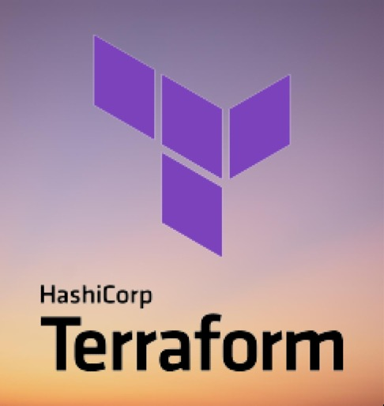
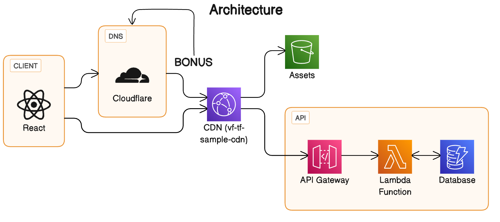
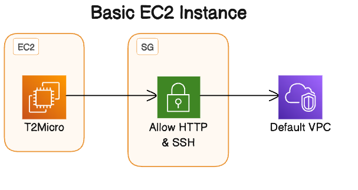

## Introduction

This workshop is designed to help you get started with Terraform. It will cover the basics of Terraform, and will give you the skills you need to manage your infrastructure as code.

## Prerequisites

- !**Basic understanding of AWS and Cloud infrastructure**!
- An understanding of what Infrastructure as Code is
- An AWS account
- An AWS IAM user with programmatic access
- AWS CLI installed on your local machine [AWS CLI Installation](https://docs.aws.amazon.com/cli/latest/userguide/getting-started-install.html)
- SAM CLI installed on your local machine (Optional - You can skip this step if you do not want to test your lambda locally)
- Terraform installed on your local machine

```markdown
If you don't have terraform installed on your Mac, you can install it using Homebrew: `brew install terraform`
```

- An IDE or text editor of your choice
- A stable internet connection and access to this github repo

## What is Infrastructure as Code?

Let's get ChatGPT give us the perfect answer

```bash +exec
# exec
node chatGPT.mjs "What is Infrastructure as Code?"
```

<!--end_slide-->

<!--column_layout: [2,1]-->
<!--column: 0-->

# What is Terraform?

Terraform is an infrastructure as code tool created by HashiCorp that lets you define both cloud and on-prem resources in human-readable configuration files that you can version, reuse, and share. You can then use a consistent workflow to provision and manage all of your infrastructure throughout its lifecycle. Terraform can manage low-level components like compute, storage, and networking resources, as well as high-level components like DNS entries and SaaS features.

_**source: <https://developer.hashicorp.com/terraform/introm>**_

<!--column: 1-->



<!--reset_layout-->

<!--pause-->

## How is this different from CloudFormation?

Terraform is cloud agnostic, meaning it can be used to manage infrastructure on any cloud provider or even multiple cloud providers at once. CloudFormation is a cloud specific tool provided by AWS to manage infrastructure on AWS only. For instance, if you'd want to create your infrastructure on AWS, a DNS record on Cloudflare, and monitoring for these resources in Datadog, you'd have to use CloudFormation, Cloudflare's API, and Datadog's API to manage these resources. With Terraform, you can manage all of these resources in one place.

> Another cloud agnostic tool is Pulumi, which is a competitor to Terraform. Pulumi is a great tool, but it is not as mature as Terraform and is not as widely used.

<!--pause-->

## What will you learn in this workshop?

- Terraform Overview and Setup
- Terraform Basics

  - Providers
  - Resources
  - Variables
  - Outputs

- Terraform State

  - Local State
  - Remote State

- Advanced Terraform

  - Locals
  - Data Sources
  - Modules
  - Expressions & Functions
  - Meta-Arguments

- **Workshop Example:** Creating a simple lambda, API Gateway, S3 bucket, Cloudfront distribution, and DynamoDB table

**Bonus:** Cloudflare DNS record

**Bonus:** S3 bucket to store your Terraform state

<!--end_slide-->

## Architecture

At the end of this workshop, you will have deployed the following architecture on AWS and Cloudflare:



The system consists of:

- A Cloudflare DNS record with a CNAME pointing to our Cloudfront distribution (**Bonus**)
- A Cloudfront distribution
  - With S3 bucket as the origin to serve our static website
  - With an endpoint `/api` that points to our API Gateway
- An API Gateway
  - With a lambda integration
  - With a DynamoDB table as the backend
- An S3 bucket to store our static website

<!--end_slide-->

Terraform Overview & Basics
---

### Terraform Setup

**Scope & Code** - Architect your infrastructure and write Terraform configuration.

Structure your Terraform Directory:

```markdown
.
├── terraform.tfstate # The state file that terraform uses to keep track of the resources it manages
├── main.tf # main terraform file where all the configuration is defined
├── variables.tf # variables used in the main.tf file
└── provider.tf # All the cloud providers used in the project and their configuration (e.g. AWS, Cloudflare and their respective credentials)
```

<!--pause-->

### Terraform Providers

Providers are plugins which are installed to interact with the respective cloud provider. Each provider has its own set of resources exposed which can be used to manage the resources on that cloud provider via Terraform, without which Terraform would have no idea how to interact with the cloud provider. For instance, the AWS provider has resources like `aws_s3_bucket` and `aws_lambda_function` which can be used to manage S3 buckets and Lambda functions respectively.

> Where do I find the list of resources for each provider?

For this workshop, we will be fetching our providers from the public Terraform Registry. You can find the list of resources for each provider on the [Terraform Registry](https://registry.terraform.io/browse/providers). However, you can also publish your own private providers (Not covered in this workshop).

<!--pause-->

### Terraform Resources

Resources are the most important element in Terraform. Each resource block describes one or more infrastructure objects, such as virtual networks, compute instances, or higher-level components such as DNS records.

Resources are declared in the main Terraform configuration file `main.tf` and are defined by a resource block:

```terraform
resource "aws_s3_bucket" "my_bucket" {
  bucket = "my-bucket"
  acl    = "private"
}
```

The above resource block creates an S3 bucket with the name `my-bucket` and sets the access control list to `private`.

> Where do I find the list of resources for each provider?

Each provider has documented resources on the [Terraform Registry](https://registry.terraform.io/browse/providers). For instance, the AWS provider - https://registry.terraform.io/providers/hashicorp/aws/latest/docs - has a list of all the resources it supports.

<!--end_slide-->

Terraform Overview & Basics
---

## Terraform Variables

Variables are used to parameterise your Terraform configuration. Variables are defined in the `variables.tf` file and are referenced in the `main.tf` file. Variables can be used to pass in sensitive information like credentials, or to pass in information that changes between environments like the region or environment name.

> In CI environment you would create/update a `variables.tfvars` file which contains all the variables and their respective environment values. 
> You would then pass this file to Terraform during runtime using the `-var-file` flag.
> This way you can keep your variables out of your codebase and pass them during runtime.

```terraform
variable "aws_region" {
  type    = string
  default = "eu-west-1"
}
```

## Terraform Outputs

Outputs are used to extract information from your Terraform configuration. Outputs are defined in the `main.tf` file and are referenced in the `outputs.tf` file. For instance - Outputs can be used to extract information like the URL of a resource that was created, the ID of a resource, CNAMES, etc.

```terraform
output "bucket_id" {
  value = aws_s3_bucket.my_bucket.id
}
```

## What are the commands you would typically use?

- `terraform init` - Initialise a working directory containing Terraform configuration files, download providers and plugins.
- `terraform plan` - See what Terraform will do before actually doing it.
- `terraform apply` - Execute all the changes to the infrastructure.
- `terraform destroy` - Destroy all the resources created by Terraform.

<!--end_slide-->

Task 01
---
## Initialise Terraform

We will be only using `main.tf` at this point. This will contain all the configuration for our infrastructure including the providers, resources, variables, and outputs.

> If you have cloned this repo, you can skip this step completely and simply navigate to the `tasks/01-initialise` directory.
> 
- Create a `main.tf` file in the root of your project directory.
- Add the following code to the `main.tf` file:
  
```terraform +line_numbers {1-10 | 12-15}
# Initialise the Terraform configuration with the AWS provider
# We will be using the AWS provider to create our infrastructure on AWS
terraform {
  required_providers {
    aws = {
      source  = "hashicorp/aws"
      # Pin the version of the provider to ensure that the configuration is not broken by a new version of the provider
      version = "5.31.0"
    }
  }
}

# Configure the AWS Provider
provider "aws" {
  region = "eu-west-1"
}
```

- Run `terraform init` to initialise the Terraform configuration.

```bash +exec
# exec
sh helper.sh clean ./tasks/01-initialise
# "Initialising Terraform"
cd ./tasks/01-initialise
terraform init
```

<!--end_slide-->

Task 01
---

```bash +exec
# exec
# Checking the newly created .terraform directory
tree -a ./tasks/01-initialise
cat ./tasks/01-initialise/.terraform.lock.hcl

```

We can see that the `terraform init` command has created a `.terraform` directory which now contains the downloaded AWS provider along with a `.terraform.lock.hcl`. Think of this as a `yarn.lock` file.

<!--end_slide-->

Task 01
---

<!--column_layout: [2,1]-->
<!--column: 0-->
## Understanding Terraform State

The state file is a JSON file that contains a mapping of all the resources or data that Terraform manages. It is used by Terraform to keep track of the resources it manages.

This file is extremely important and should be treated as a sensitive file. It contains all the information about your infrastructure and should not be shared with anyone. 

- Can be stored locally
- Can be stored remotely (e.g. S3 bucket, Terraform Cloud) - Most recommended and used


## Local vs Remote State

| Local State                    | Remote State                                                          |
| ------------------------------ | --------------------------------------------------------------------- |
| Stored locally on your machine | Stored remotely on a remote backend (e.g. S3 bucket, Terraform Cloud) |
| Doesn't support locking        | Supports locking                                                      |
| No cross-team collaboration    | Allows cross-team collaboration + CI/CD Automation                    |
| No additional cost             | Additional cost for remote backend                                    |

<!--column: 1-->
```json {2-6|8-14|16-41} 
{
  //Terraform metadata
  "version": 4,
  "terraform_version": "1.5.7",
  "serial": 8,
  "lineage": "c3b4816c-3fd0-6fad-c326-cae29f5d02b2",

  //Outputs produced by Terraform
  "outputs": {
    "ip": {
      "value": "3.253.106.183",
      "type": "string"
    }
  },

  //Resources managed by Terraform
  "resources": [
    {
      "mode": "managed",
      "type": "aws_instance",
      "name": "demo_instance",
      "provider": "provider[\"registry.terraform.io/hashicorp/aws\"]",
      "instances": [
        {
          "schema_version": 1,
          "attributes": {
            "ami": "ami-0905a3c97561e0b69",
            "arn": "arn:aws:ec2:eu-west-1:xxx:instance/xxx",
            "associate_public_ip_address": true,
            "availability_zone": "eu-west-1b",
            "...Other attributes": "...",
          },
          "dependencies": [
            "aws_default_vpc.default",
            "aws_security_group.demo"
          ]
        }
      ]
    }
  ],
  "check_results": null
}
```

<!--end_slide-->

Task 01
---

## Terraform Plan

The `terraform plan` command allows us to compare the current state of our infrastructure with the desired state of our infrastructure. It will show us what changes Terraform will make to our infrastructure if we were to run `terraform apply`.

🚀 Demo Time 🚀

```bash +exec
# exec

sh helper.sh uncomment ./tasks/01-initialise/main.tf 20 58
cd ./tasks/01-initialise
ls 
code-insiders main.tf
```

<!--pause-->

Seeing the changes that Terraform will make to our infrastructure:

```bash +exec
# exec

sh helper.sh osa ./tasks/01-initialise "terraform plan"
```
<!--pause-->

Applying the changes:

```bash +exec
# exec

sh helper.sh osa ./tasks/01-initialise "terraform apply"
```

> You can also use the `-auto-approve` flag to skip the confirmation prompt.
> ⭐️ You should now be able to see the Default VPC in your account named with "Default VPC" & a new security group named "EC2 Demo Security Group"


Let's now check the updated state file:

```bash +exec
# exec

cd ./tasks/01-initialise
code-insiders terraform.tfstate
```

<!--end_slide-->

Task 01
---

# Architecture


Creating an EC2 instance:

```bash +exec
# exec
sh helper.sh uncomment ./tasks/01-initialise/main.tf 59 89
cd ./tasks/01-initialise
code-insiders main.tf
```

Checking the changes that Terraform will make to our infrastructure:

```bash +exec
# exec
sh helper.sh osa ./tasks/01-initialise "terraform plan"
```

Applying the changes:

```bash +exec
# exec
sh helper.sh osa ./tasks/01-initialise "terraform apply"
```

Checking the updated state file:

```bash +exec
# exec
cd ./tasks/01-initialise
code-insiders terraform.tfstate
```
<!--end_slide-->

Task 01
---

**💡 TIP**: You can also make use of `terraform show` to see the entire mapping of the resources that Terraform manages along the actual values of the resources as seen in AWS or your state file.

```bash +exec
# exec
sh helper.sh osa ./tasks/01-initialise "terraform show"
```

Alternatively, if you want a more concise view of the resources that Terraform manages, you can make use `terraform state list`.

```bash +exec
# exec
cd ./tasks/01-initialise
terraform state list
```


<!--end_slide-->

Task 01
---

<!--column_layout: [2,1]-->
<!--column: 0-->
## Terraform Destroy

`terraform destroy` is used to destroy all the resources created by Terraform. It utilises the state file to know which resources to destroy. 

Please note that this command will destroy all the resources created by Terraform. If you have created any resources manually, Terraform will not be able to destroy them.

**!! USE WITH CAUTION !!**

You will only want to run this command when you are sure you want to clean up all the resources created by Terraform for this project. You would most probably not want to run this command in a production environment.

<!--column: 1-->


<!--reset_layout-->

```bash +exec
# exec
sh helper.sh osa ./tasks/01-initialise "terraform destroy"
```

<!--pause-->

Checking the updated state file:

```bash +exec
# exec
cd ./tasks/01-initialise
echo "Check the state file"
terraform state list
```

<!--end_slide-->

Task 02 - Locals, Variables & Outputs
---

<!--column_layout: [2,1]-->
<!--column: 0-->
## Terraform Variables

In the previous task we hardcoded a number of values in our terraform configuration. While this is fine for your local project, you would want to parameterise your configuration when working in a team or when deploying to different environments.

That's where terraform variables come in. Variables are used to parameterise your Terraform configuration. Variables are defined in the `variables.tf` file and are referenced in the `main.tf` file. Variables can be used to pass in sensitive information like credentials, or to pass in information that changes between environments like the region or environment name.

<!--column: 1-->


<!--reset_layout-->

We have different types of variables in Terraform:

```terraform {1-6 | 8-13 | 15-20}
# Input Variables - these variables are configurable by the user
variable "instance_ami" {
  type      = string
  default   = "ami-0905a3c97561e0b69"
  sensitive = false
}

# Local Variables - these are temporary variables that can be used to simplify your configuration
# Example: If any value is used more than once in your configuration, you can create a local variable for it
locals {
  aws_region   = "eu-west-1"
  project_name = "terraform-workshop"
}

# Output Variables
# These variables are used to extract information from your Terraform configuration. They can also be referenced in other Terraform configurations
output "instance_ip" {
  value = aws_instance.demo_instance.public_ip
}
```

*source: https://developer.hashicorp.com/terraform/language/values*

<!--end_slide-->

Task 02
---

## Supported Variable Types

Terraform supports the following variable types:

<!--column_layout: [1,2]-->
<!--column: 0-->
Your Basic Types:

- `string`
- `number`
- `bool`

<!--column: 1-->
Complex Types:

- `list`   - A list of values of the same type - e.g. `["a", "b", "c", "a"]`.
- `map`    - A map of values of the same type- e.g. `{a = "b", c = "d"}`.
- `set`    - A set of unique values of the same type - e.g. `["a", "b", "c"]`.
- `object` - A complex type that contains multiple attributes - e.g. `{a = "b", c = 1}`.
- `tuple`  - A tuple of values of different types - e.g. `["a", 1, true]`.

<!--reset_layout-->
## Precedence Order

Variables can be defined in multiple places and in multiple ways. Terraform uses the following precedence order to determine which value to use:

- Environment variables (e.g. `TF_VAR_<variable_name>`)
- The `terraform.tfvars` file, if present.
- `terraform.tfvars.json` file, if present.
- Any `*.auto.tfvars` or `*.auto.tfvars.json` files, processed in lexical order of their filenames.
- `-var` and `-var-file` command-line options, which can be repeated multiple times to load from multiple files or set multiple values.

### What does this mean?
<!--column_layout: [1,2]-->
<!--column: 0-->

```terraform
# variables.tf
variable "aws_region" {
  type    = string
  default = "eu-west-1"
}
```

By default any resource that uses the `aws_region` variable will use the value `eu-west-1`. Unless we override it using one of the methods mentioned above.

*source: https://developer.hashicorp.com/terraform/language/values/variables#variable-definition-precedence*
<!--column: 1-->

```bash {1-4| 6-8 | 9-16 | 17 - 22}
# As an environment variable
export TF_VAR_aws_region="eu-west-1"

# Now any resource that uses the aws_region variable will use the value eu-west-1

# terraform.tfvars - this will override the default value & the environment variable
aws_region = "eu-west-1"

# *.auto.tfvars - this will override the default value, the environment variable & the terraform.tfvars file
# int1.auto.tfvars
aws_region = "eu-west-1"
# If you have multiple auto.tfvars files, they will be processed in lexical order of their filenames
# int2.auto.tfvars
aws_region = "eu-west-2"

# Any resource that uses the aws_region variable will use the value eu-west-2

# -var flag - this will override all the above values
terraform plan -var "aws_region=eu-west-1"
# You can also pass in a file containing all the variables
terraform plan -var-file="custom.tfvars" # assuming custom.tfvars contains the aws_region = "eu-west-1" variable
# Any resource that uses the aws_region variable will use the value eu-west-1
```

<!--reset_layout-->

<!--end_slide-->

Task 02
---

## Handling Sensitive Information

You can mark a variable as sensitive by setting the `sensitive` attribute to `true`. This will prevent the variable from being displayed in the output of `terraform plan` and `terraform apply`. 

These values are often passed in as environment variables, via a `.tfvars` file or from a secret management tool like AWS Secrets Manager

<!--column_layout: [1,1]-->
<!--column: 0-->
```terraform {1-5 | 7-10}
variable "aws_region" {
  type      = string
  default   = "eu-west-1"
  sensitive = false
}

variable "secret_id" {
  type      = string
  sensitive = true
}
```

<!--column: 1-->
```bash {1-4}
# output of terraform plan
+ resource "aws_vpcxxx" "default" {
    + arn                              = (known after apply)
    + aws_region                       = "eu-west-1"
    + id                               = (sensitive value)
}
```

<!--reset_layout-->

## How do we handle tfvars files in CI at Vodafone?

At Vodafone we make use of `terraform.tfvars` file to store the values of our variables. The values are often referenced to environment variables which are passed in during runtime. We also make use of a CI step called `Replace Tokens` which replaces the values of the variables in the `terraform.tfvars` file with the values of the environment variables.

```bash {1-4| 6-9 | 11-20 | 21-26} +line_numbers
# vsts_variables.tfvars (Before)
aws_region = "${AWS_REGION}"
aws_access_key = "${AWS_ACCESS_KEY}"
aws_secret_key = "${AWS_SECRET_KEY}"

# example of a .env file
AWS_REGION=eu-west-1
AWS_ACCESS_KEY=xxx
AWS_SECRET_KEY=xxx

# deploy.yml - ci step
# This step replaces the values of the variables in the terraform.tfvars file with the values of the environment variables
task: qetza.replacetokens.replacetokens-task.replacetokens@3
displayName: Replace tokens on tfvars
inputs:
  targetFiles: |
    vsts_variables.tfvars => variables.auto.tfvars # renames the file to variables.auto.tfvars after replacing the tokens
  tokenPrefix: '${'
  tokenSuffix: '}'
  verbosity: detailed  

# The above step will replace the values of the variables in the terraform.tfvars file with the values of the environment variables
# variables.auto.tfvars (After)
aws_region = "eu-west-1"
aws_access_key = "xxx"
aws_secret_key = "xxx"
```

<!--end_slide-->

Task 02 - Locals, Variables & Outputs
---

# Demo Time 🚀

Navigate into the `tasks/02-handle-variables` directory.

```bash +exec
# exec
sh helper.sh clean ./tasks/02-handle-variables
cd ./tasks/02-handle-variables
code-insiders .
```

<!--pause-->
<!--column_layout: [2,1]-->
<!--column: 1-->

*Image by luis_molineroon on Freepik*

<!--column: 0-->
Anyone notice anything different about the `main.tf` file?

<!--pause-->
What about the new files in the directory?

<!--pause-->

Does anyone want to take a guess at the contents of the `variables.tf` or `locals.tf` file?

<!--pause-->

<!--reset_layout-->

Let's run `terraform init` again to initialise the Terraform configuration, and then plan the changes that Terraform will make to our infrastructure.

```bash +exec
# exec
sh helper.sh osa ./tasks/02-handle-variables "terraform init && terraform plan --input=false"
```

<!--end_slide-->

Task 02 - Locals, Variables & Outputs
---

<!--column_layout: [1,2]-->
<!--column: 0-->

*Image by luis_molineroon Freepik*
<!--column: 1-->
Can anyone guess how we can fix this error?

```bash
│ Error: No value for required variable
│
│   on variables.tf line 16:
│   16: variable "instance_ssh_password" {
│   
│   The root module input variable "instance_ssh_password" is not set, and has no
│   default value. Use a -var or -var-file command line argument to provide a
│   value for this variable.
╵

```

<!--pause-->
<!--reset_layout-->

<!--column_layout: [2,1]-->
<!--column: 1-->

*Image by luis_molineroon Freepik*
<!--column: 0-->

🎉 Time to apply the changes 🎉


**🚨 This step may fail if you do not have an ssm `/vf-email`**

```bash +exec
# exec
# By passing in the value of the variable using the `-var` flag.
sh helper.sh osa ./tasks/02-handle-variables "terraform plan --input=false -var 'instance_ssh_password=12345678'"
```
<!--pause-->

```bash +exec
# exec
sh helper.sh osa ./tasks/02-handle-variables "terraform apply -auto-approve --input=false -var 'instance_ssh_password=12345678'"
```
<!--pause-->


<!--reset_layout-->
## Verifying Changes

```bash +exec
# exec
cd ./tasks/02-handle-variables
echo $(terraform output --raw instance_ip)
curl http://$(terraform output --raw instance_ip)
```

## Destroying the resources

```bash +exec
# exec
sh helper.sh osa ./tasks/02-handle-variables "terraform destroy -auto-approve --input=false -var 'instance_ssh_password=12345678'"
```

<!--end_slide-->

Task 03 - Advanced Terraform
---

## Expressions & Functions

Whilst we wont be covering these topics in this workshop, you can find more information about the following topics here:
| Expressions                                                    | Functions                                                    |
| -------------------------------------------------------------- | ------------------------------------------------------------ |
| https://developer.hashicorp.com/terraform/language/expressions | https://developer.hashicorp.com/terraform/language/functions |

## Usage 
Expression Example:  

Operators (+,-), Conditionals ( 1 > 2 ? true : false), etc.

```terraform
locals {
  aws_region   = "eu-west-1"
  project_name = "terraform-workshop"
  project_id   = "${local.project_name}-${local.aws_region}"
  ## project_id = "terraform-workshop-eu-west-1"
  project_is_prod = "${local.aws_region == "eu-west-1" ? true : false}"
  ## project_is_prod = true
} 
```

Function Example:
`format` function is used to format a string using a template. `format("%s-%s", "foo", "bar")` will return `foo-bar`, `jsonencode` function is used to convert a value to a JSON string. e.g. `jsonencode({foo = "bar"})` will return `{"foo":"bar"}` 

```terraform
# function example
locals {
  aws_region   = "eu-west-1"
  project_name = "terraform-workshop"
  project_id   = format("%s-%s", local.project_name, local.aws_region)
  ## project_id = "terraform-workshop-eu-west-1"
}
```

<!--end_slide-->

Task 03 - Advanced Terraform
---
## Meta-Arguments
> Please note - we will not be running any of the commands in this section. This is just to give you an idea of what these meta-arguments are used for.
### Count

The `count` meta-argument is used to create multiple instances of a resource or module. It is used to create multiple resources of the same type. For instance, if you wanted to create 3 EC2 instances, you would use the `count` meta-argument.

```terraform
resource "aws_instance" "demo_instance" {
  count = 3
  ami   = "ami-0905a3c97561e0b69"
  ...
}
```

### For-Each

`for_each` allows us to create multiple instances of a resource or module with different configurations. For instance, if you wanted to deploy 2 EC2 Instances with different images, you would use the `for_each` meta-argument.

```terraform
resource "aws_instance" "demo_instance" {
  for_each = {
    instance1 = "ami-0905a3c97561e0b69"
    instance2 = "ami-047bb4163c506cd98"
  }
  # this will create 2 EC2 instances with different AMIs
  ami   = each.value
  ...
}
```

### Lifecycle

`lifecycle` is used to describe the general behaviour of a resource. For instance, if you wanted to prevent a resource from being destroyed, you would use the `prevent_destroy` meta-argument, or if you want to create a resource before destroying the old one, you would use the `create_before_destroy` meta-argument.

```terraform
resource "aws_instance" "demo_instance" {
  ami   = "ami-0905a3c97561e0b69"
  ...
  lifecycle {
    prevent_destroy = true
  }
}
```

<!--end_slide-->

Task 03 - Advanced Terraform
---

## Modules

Modules are containers used to group resources together. They are used to organise your Terraform configuration and to reuse your Terraform code. Modules can be used to create reusable components that can be used across multiple projects. For instance, you can create a module that creates an S3 bucket, and then use that module in multiple projects.

> 🧠 We make use of the datadog module created by SRE across almost all of our projects at Vodafone. This module creates a datadog dashboard, monitors, and alerts.
> 
> Modules can be versioned

```bash
# Module Structure - datadog
.
├── main.tf
├── outputs.tf
├── variables.tf
└── README.md

# Readme will contain the documentation for the module and how to use it
```

```terraform
# Usage of the datadog module
# main.tf (within the project)

module "datadog" {
  source  = "s3::https://s3-eu-west-1.amazonaws.com/dx-systems-terraform-modules/latest/datadog/synthetics/browser-new."
  name                   = "terraform-workshop"
  environment            = "dev"
  ...other parameters required by the module
}

```

<!--end_slide-->

Task 04 - Workshop
---

Congratulations on making it this far! 🎉

You now have all the skills you need to create your own infrastructure on AWS using Terraform.

Time to create our lambda, API Gateway, S3 bucket, Cloudfront distribution, and DynamoDB table.

## Refresher on the Architecture


## Let's get started
<!--column_layout: [2,1]-->
<!--column: 1-->


<!--column: 0-->

```bash +exec
# exec
sh helper.sh clean ./tasks/03-workshop
cd ./tasks/03-workshop
code-insiders .
```

<!--reset_layout-->
> Please note: The boilerplate code for the React app and Lambda function has already been provided for you. You can find the code within the `tasks/03-workshop` directory.
> This is to save time and to focus on the Terraform configuration.

<!--end_slide-->